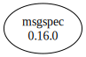

# Third Party Dependencies

<!--[[[fill sbom_sha256()]]]-->
The [SBOM in CycloneDX v1.4 JSON format](https://git.sr.ht/~sthagen/kutoa/blob/default/etc/sbom/cdx.json) with SHA256 checksum ([9b81f73b ...](https://git.sr.ht/~sthagen/kutoa/blob/default/etc/sbom/cdx.json.sha256 "sha256:9b81f73ba541986f557ef67cb145e9ea6f730eb4cb4bc9a5964da3eb09b03263")).
<!--[[[end]]] (checksum: 488c9741e278c4feddfeb3ae2686c173)-->
## Licenses 

JSON files with complete license info of: [direct dependencies](direct-dependency-licenses.json) | [all dependencies](all-dependency-licenses.json)

### Direct Dependencies

<!--[[[fill direct_dependencies_table()]]]-->
| Name                                        | Version                                            | License     | Author          | Description (from packaging data)                                                                        |
|:--------------------------------------------|:---------------------------------------------------|:------------|:----------------|:---------------------------------------------------------------------------------------------------------|
| [msgspec](https://jcristharif.com/msgspec/) | [0.16.0](https://pypi.org/project/msgspec/0.16.0/) | BSD License | Jim Crist-Harif | A fast serialization and validation library, with builtin support for JSON, MessagePack, YAML, and TOML. |
<!--[[[end]]] (checksum: 2dace89c8af260977a52ea681ae1ed6f)-->

### Indirect Dependencies

<!--[[[fill indirect_dependencies_table()]]]-->
| Name | Version | License | Author | Description (from packaging data) |
|:-----|:--------|:--------|:-------|:----------------------------------|
<!--[[[end]]] (checksum: 8a87b89207db0be2864af66f9266660c)-->

## Dependency Tree(s)

JSON file with the complete package dependency tree info of: [the full dependency tree](package-dependency-tree.json)

### Rendered SVG

Base graphviz file in dot format: [Trees of the direct dependencies](package-dependency-tree.dot.txt)



### Console Representation

<!--[[[fill dependency_tree_console_text()]]]-->
````console
msgspec==0.16.0
````
<!--[[[end]]] (checksum: 65c530d389ea3bf9a288fd12fdb4b161)-->
